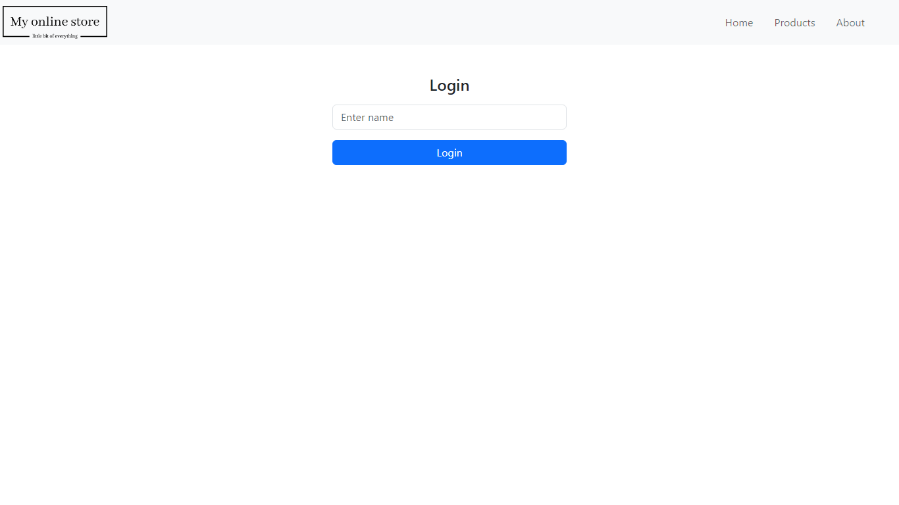

# My Online Store

## Description

My Online Store is a React-based web application that offers a variety of products for sale. The application allows users to view product details, select different colors for the products, and purchase them while keeping track of the total price. The application also includes an About page and a user login feature.

- **[Installation](#installation)**
- **[Deployment](#deployment)**
- **[Resources](#resources)**
- **[Contributing](#contributing)**
- **[Questions](#questions)**
- **[License](#license)**

## Installation

To install necessary dependencies, run the following command:

```
npm install 
```

## Deployment 

Visit the live site here: [My Online Store](https://pav85.github.io/online-store-app/)

Here's a preview of the application:



## Resources

- Product data fetched from [Fake Store API](https://fakestoreapi.com/).
- Built with [React](https://reactjs.org/), [React Router](https://reactrouter.com/), [React Bootstrap](https://react-bootstrap.netlify.app/), and [Axios](https://axios-http.com/).

## Contributing

Fork this repository and submit a pull request to contribute.

## Questions

For inquiries, please open an issue or contact me at pawel-werbowy@gmail.com. 
Check out more of my work at [GitHub - Pav85](https://github.com/pav85).

## License

This project is licensed under the MIT license.